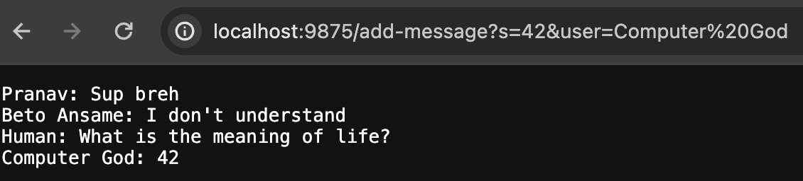

# **Lab Report 2**

Pranav Reddy Bussannagari
***

## Code for ChatServer

## Screenshot 1

> ## Methods from my code
> `Server.start(int port, new Handler())`;
-   Arguments: integer value for which port to listen on, Handler object
-   No values changed as this function just starts a server on the local computer
> Default Constructor for `Handler` class
-   Arguments: none
-   The `String chatHistory` is created, which will be used to add the formatted message onto the webpage
> `handleRequest(URI url)` from `Handler` class
-   Arguments: `URI url` 
-   If the proper path is provided, updates `String chatHistory` with the formatted message to be printed onto the webpage
> `main(String[] args)` from `ChatServer`
-   Arguments: `String[] args`, specifically an Integer to be parsed into being the port number
-   Updates `port` with the number passed in, provided a valid number for the computer to be listening on is provided

> ## Other methods executed
> `getPath()`

## Screenshot 2

