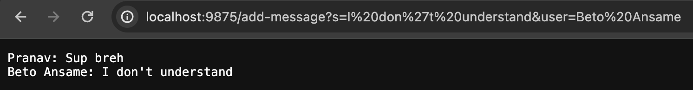

# **Lab Report 2**

Pranav Reddy Bussannagari
***

## Screenshot 1

* Methods called: `Server.start()`, Default Constructor for `Handler` class, `handleRequest(URI url)` from Handler class, 

## Screenshot 2

