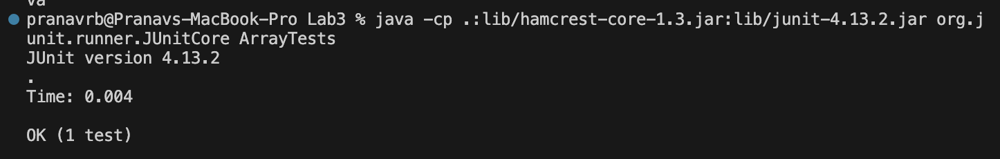
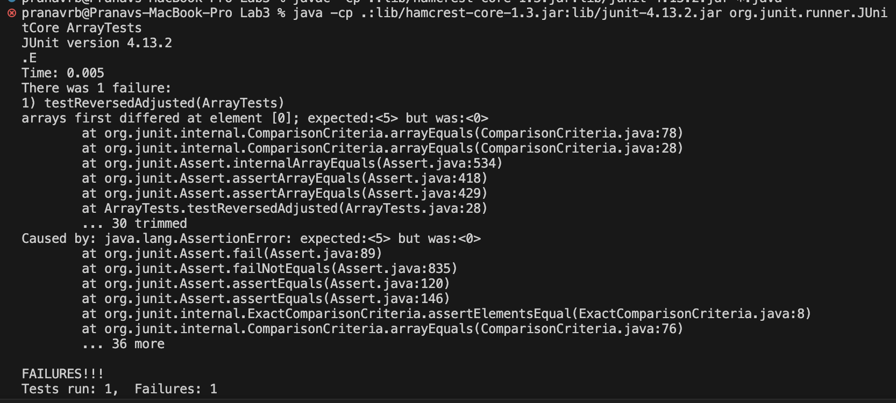

# Part 1 (`reversed()` in `Array Examples`)

## - A Failure-Inducing Input
> 
> 
      @Test
      public void testReversed() {
     
        int[] input1 = {1,2,3,4,5};
     
        assertArrayEquals(new int[]{5,4,3,2,1}, ArrayExamples.reversed(input1));
     
      }

## - A Working Input
> 
> 
      @Test
      public void testReversed() {
     
        int[] input1 = { };
     
        assertArrayEquals(new int[]{ }, ArrayExamples.reversed(input1));
     
      }

## - Symptom
-   Working Output

-   Failure Output

## - Bug
-   Before
> 
>
    static int[] reversed(int[] arr) {

        int[] newArray = new int[arr.length];
    
        for(int i = 0; i < arr.length; i += 1) {
          arr[i] = newArray[arr.length - i - 1];
        }
        return arr;
    }

- After
>
>
    static int[] reversed(int[] arr) {
      
        int[] newArray = new int[arr.length];
    
        for(int i = 0; i < arr.length; i += 1) {
          newArray[arr.length - i - 1] = arr[i];
        }
      
        return newArray;
    }

- **Explanation of Fix:** 
  The fix above works as the original code's bug was that it didn't rigorously test the `reverse()` method at all, creating an empty array to feed into it but not a comprehensive, filled array. By making this switch, I ensure that when the code is passed in with a 5 element `int[]` array, it properly returns the reverse copy of that array, checking with the hand-checked reversed array in the test method. 

# Part 2 (Researching `grep`)
1. Command 1: `grep -l` (Found using `man grep`)
- Source Used: *“Grep ¶.” GNU Grep 3.11, www.gnu.org/software/grep/manual/grep.html. Accessed 13 Feb. 2024.*
- Example 1: `grep -l` lists the names of the files, rather than the direct lines from the files, which contain the specified string. In this case, grep -r recursively searches the `technical` directory for matches to *''base pairs''*, and `-l` forces the output to list the names of the files, rather than each line in the file that contains the phrase. 
>
> 
      pranavrb@Pranavs-MacBook-Pro technical % grep -r -l  "base pair" .          
            ./plos/journal.pbio.0020223.txt
            ./plos/journal.pbio.0020190.txt
            ./biomed/1471-2156-2-3.txt
            ./biomed/1471-2121-3-10.txt
            ./biomed/gb-2001-2-4-research0010.txt
            ./biomed/gb-2003-4-4-r24.txt
            ./biomed/gb-2001-2-4-research0011.txt
            ./biomed/1471-2229-2-3.txt
            ./biomed/gb-2001-2-7-research0025.txt
            ./biomed/1471-2458-3-5.txt
            ./biomed/1471-2199-2-12.txt
            ./biomed/gb-2001-2-3-research0008.txt
            ./biomed/gb-2001-2-8-research0027.txt
            ./biomed/1471-2350-2-2.txt
            ./biomed/1472-6750-1-13.txt
            ./biomed/1471-2474-2-1.txt
            ./biomed/1471-2156-3-16.txt
            ./biomed/ar297.txt
            ./biomed/bcr631.txt
            ./biomed/gb-2001-2-4-research0014.txt
            ./biomed/1471-2156-2-7.txt
            ./biomed/1471-2105-4-27.txt
            ./biomed/ar409.txt
            ./biomed/1471-2164-4-21.txt
            ./biomed/1471-2180-3-15.txt
            ./biomed/1471-2202-2-12.txt
            ./biomed/1471-2180-1-12.txt
            ./biomed/1471-2105-2-9.txt
            ./biomed/1471-2105-2-8.txt
            ./biomed/gb-2002-3-12-research0079.txt
            ./biomed/1471-2164-3-13.txt
            ./biomed/gb-2001-2-6-research0021.txt
            ./biomed/gb-2002-3-12-research0083.txt
            ./biomed/1471-2180-3-13.txt
            ./biomed/1471-2377-3-4.txt
            ./biomed/1471-2164-4-25.txt
            ./biomed/1471-2156-3-4.txt
            ./biomed/1471-213X-1-4.txt
            ./biomed/1471-2210-2-14.txt
            ./biomed/1471-2180-1-31.txt
            ./biomed/1475-4924-1-5.txt
            ./biomed/1471-2164-4-14.txt
            ./biomed/1471-2164-3-35.txt
            ./biomed/1471-2164-4-16.txt
            ./biomed/ar774.txt
            ./biomed/gb-2000-1-1-research002.txt
            ./biomed/1471-2105-3-18.txt
            ./biomed/1471-2105-3-24.txt
            ./biomed/1471-2199-3-17.txt
            ./biomed/1471-2164-3-31.txt
            ./biomed/1471-2164-3-6.txt
            ./biomed/1471-2156-2-17.txt
            ./biomed/gb-2002-3-6-research0029.txt
            ./biomed/1471-2121-1-2.txt
            ./biomed/1471-2180-1-34.txt
            ./biomed/1471-2164-3-7.txt
            ./biomed/1471-2202-3-7.txt
            ./biomed/1471-2334-3-12.txt
            ./biomed/1471-2164-2-1.txt
            ./biomed/1477-7827-1-23.txt
            ./biomed/bcr602.txt
            ./biomed/1471-2091-3-4.txt
            ./biomed/gb-2001-2-12-research0054.txt
            ./biomed/1471-2105-3-2.txt
            ./biomed/gb-2002-3-10-research0053.txt
            ./biomed/rr196.txt
            ./biomed/bcr571.txt
            ./biomed/1471-2180-2-38.txt
            ./biomed/1471-2164-2-7.txt
            ./biomed/1471-2199-2-5.txt
            ./biomed/bcr570.txt
            ./biomed/1471-2202-3-16.txt
            ./biomed/1471-2180-2-13.txt
            ./biomed/1471-2350-2-8.txt
            ./biomed/1471-2164-2-4.txt
            ./biomed/1471-2164-4-2.txt

- Example 2
>
>
      
2. Command 2: `grep -c` (Found using `man grep`)
- Source Used: *“Grep ¶.” GNU Grep 3.11, www.gnu.org/software/grep/manual/grep.html. Accessed 13 Feb. 2024.*
3. Command 3: `grep -i` (Found using `man grep`)
- Source Used: *“Grep ¶.” GNU Grep 3.11, www.gnu.org/software/grep/manual/grep.html. Accessed 13 Feb. 2024.*
4. Command 4: `grep -v` (Found using `man grep`)
- Source Used: *“Grep ¶.” GNU Grep 3.11, www.gnu.org/software/grep/manual/grep.html. Accessed 13 Feb. 2024.* 

# Sources Used
1. “Grep ¶.” GNU Grep 3.11, www.gnu.org/software/grep/manual/grep.html. Accessed 13 Feb. 2024.
2. `man grep` Command (
