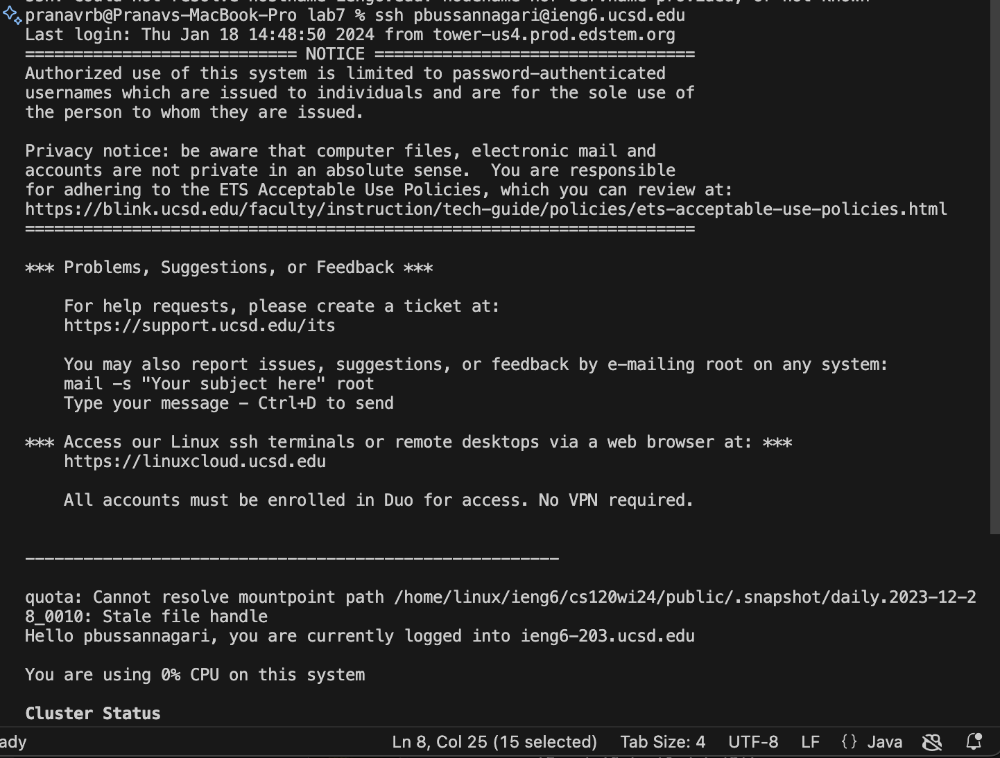
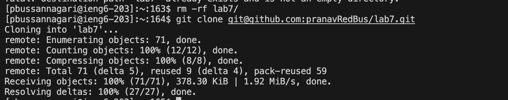
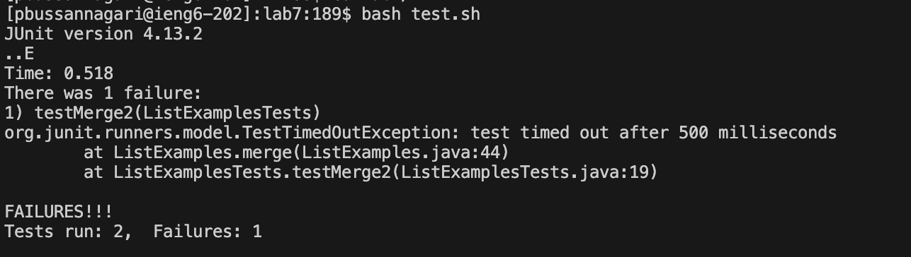
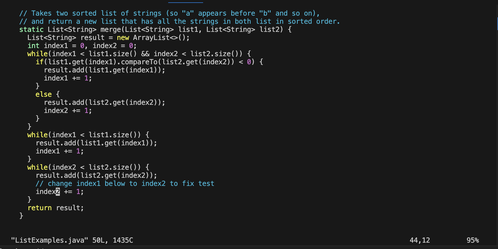
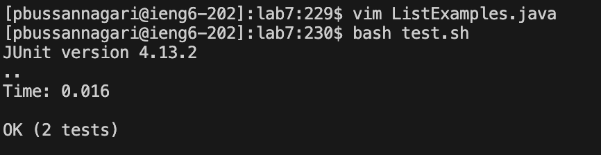
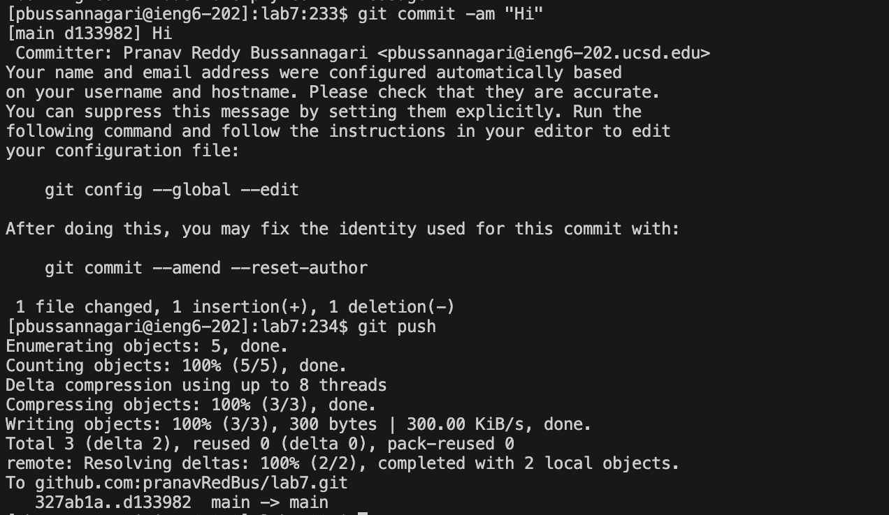
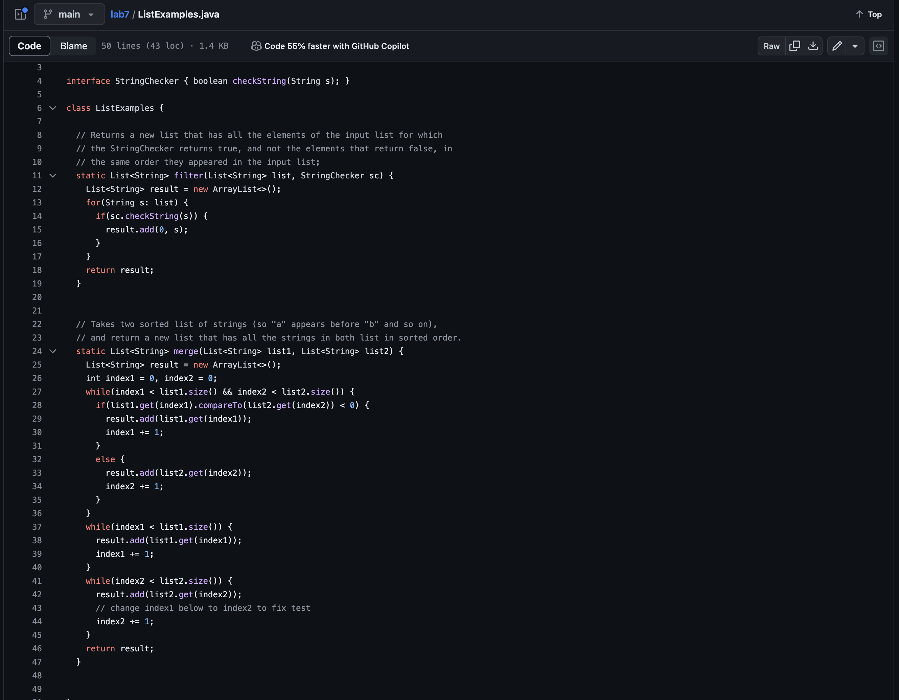

# Lab Report 4
> By Pranav Reddy Bussannagari

## Step 4
1. Type "`ssh pbussannagari@ieng6.ucsd.edu`" + `<enter>`

> Summary: Logged into one of the `ieng6` servers to clone repo and use `vim` 

***

## Step 5
1. Type "`rm -rf l` + `<tab>`"
2. Copy the `ssh` url to clone the Lab7 Repository (`git@github.com:pranavRedBus/lab7.git`) to clipboard
3. Type "`git clone` + `<cmd>` + `V`" + `<enter>`

> Summary: Removing existing Lab 7 repository and then cloning a new `lab7` repository by copying through the `ssh` URL command line and pasting with `git clone`

***

## Step 6
1. Type `cd lab7` + `<enter>`
2. Type "`bash test.sh`" + `<enter>`

> Summary: Change directory to `lab7`. Demonstrating the `ListExamplesTests.java`'s tests failed by running the script containing the information used to compile and run `ListExamplesTests.java`, our tester file.

***

## Step 7
1. Type "`vim ListExamples.java`" + `<enter>`
2. Click "43" + "`j`"
3. Click "6" + "`<right>`"
4. Click "`e`"
5. Click "`r`" + "2"
6. Type "`:``w``q`" + `<enter>`

> Summary: Enter vim on `ListExamples.java` and then get to the character that is needed to change, using the arrow keys and/or the `h`, `j`, `k`, `l` keys, replacing that character using key `r`, and then exiting by using "`:wq`".

***

## Step 8
1. Type "`bash test.sh`"
2. Click `<enter>`

> Summary: Retyping `bash test.sh` to run the script containing the information used to compile and run `ListExamplesTests.java`, this time showing that the tests compile and run correctly.

***

## Step 9
1. Type "`git commit -am "Hi"`" + "`<enter>`"
2. Type "`git push`" + "`<enter>`"

> Summary: Adding untracked files (files modified but not committed yet) to the tracked list and then directly committing them to the next `git push` by using `git commit` with the `-a` extension, and then using `-m` to write the custom message "Hi" when committing to Github. Then, `git push` these changes onto the main branch of the forked copy of the `lab7` repository.

